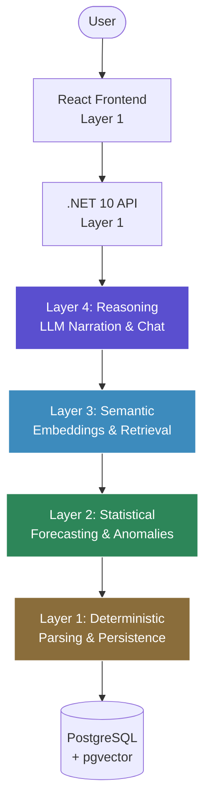

# NOSYOR.M.I — System Architecture

> *A mirror for your money.*

This document is the architectural source of truth for NOSYOR.M.I. It describes how the system is organized, why those organizational choices were made, and what principles every line of code is expected to honor. When a decision needs to be made — a new feature designed, a refactor proposed, a tool considered — it is checked against this document.

The document is intentionally written as a **living blueprint**. Sections are added as the architecture they describe is built. What is documented here is committed to; what is not yet documented is not yet binding.

---

## 1. Purpose & Philosophy

NOSYOR.M.I is not an AI app. It is a **finance engine with an AI conversation layer on top.**

That distinction matters. Most student AI projects collapse the entire system into a single LLM and route every user interaction through it. NOSYOR.M.I deliberately resists that pattern. The system is designed so that the parts that must be exact — totals, forecasts, anomaly thresholds — are exact; and the parts that benefit from natural language — explanations, conversation, narrative — are conversational. Each kind of work is given to the tool best suited to it.

The architecture is guided by three principles:

**1. Determinism over probability for numerical work.**
Where there is a single correct answer, deterministic code or statistical models produce it. LLMs are not used as calculators, forecasters, or anomaly detectors.

**2. The right tool for the right job.**
Different problems call for different tools. CSV parsing is a library problem. Forecasting is a statistical problem. Semantic search is an embedding problem. Conversation is an LLM problem. The architecture matches the tool to the problem, not the other way around.

**3. Cost-conscious model routing.**
Where LLMs are used, the cheapest model that can do the job well is used. Premium models are reserved for the moments where reasoning genuinely matters. This is enforced through a tiered model configuration (see Section 3).

These principles are non-negotiable. If a future feature appears to require violating one of them, the feature is redesigned, not the principle.

---

## 2. The Four-Layer Architecture

NOSYOR.M.I is organized into four layers. Each layer handles a distinct kind of work, with a distinct kind of tool. Higher layers build on lower layers; lower layers are independent of higher ones.

### Layer 1 — Deterministic Layer

**Purpose:** All the work that has exactly one correct answer.

This is the foundation of the entire system. It is the largest layer by code volume and the most reliable layer by behavior. It handles file ingestion (CSV and PDF parsing), data validation, database reads and writes, API request/response handling, authentication boundaries, and all user interface rendering.

Layer 1 uses no AI of any kind. Every function in this layer, given the same input, produces the same output every time. This is what allows the rest of the system to be trustworthy.

**Technologies:** .NET 10 Web API, Entity Framework Core, CsvHelper, PdfPig, React, TypeScript, Recharts.

### Layer 2 — Statistical Layer

**Purpose:** Numerical analysis with mathematically-defined answers.

This layer handles all analysis that produces numbers. It detects anomalies through statistical methods (Z-score, interquartile range, rolling averages). It forecasts future spending through time-series models. It calculates trends, identifies recurring transactions, and produces the structured data that Layer 4 will later narrate.

Like Layer 1, Layer 2 uses no LLMs. Its outputs are numerical and explainable — every anomaly comes with a quantitative justification, every forecast comes with a confidence interval. This makes the system auditable: a user can always ask "why?" and receive a mathematical answer, not a probabilistic guess.

**Technologies:** ML.NET (time-series forecasting, anomaly detection), C# math primitives.

### Layer 3 — Semantic Layer

**Purpose:** Understanding meaning and similarity in unstructured text.

Transaction descriptions on a bank statement are messy. "AMZN MKTPLACE 7/14 SEATTLE" and "AMAZON RETAIL PURCHASE" refer to the same thing, but a database doesn't know that. The Semantic Layer solves this by converting text into numerical vectors (embeddings) that capture meaning. Similar transactions land near each other in vector space; dissimilar ones land far apart.

This layer powers semantic search ("find transactions like this one"), retrieval for the chat interface ("pull the relevant transactions before the LLM answers a question"), and assists categorization where rule-based matching falls short.

The Semantic Layer is *not* an LLM. Embedding models are a separate kind of AI — they measure meaning, they do not generate text.

**Technologies:** OpenRouter embedding API (`openai/text-embedding-3-small`, 1536 dimensions), PostgreSQL with the `pgvector` extension.

### Layer 4 — Reasoning Layer

**Purpose:** Natural-language understanding, narration, and conversation.

This is where the system speaks. Layer 4 takes the structured outputs of Layers 1–3 — totals, anomalies, forecasts, retrieved transactions — and translates them into language a person can read. It answers user questions in the chat interface. It generates summaries and explanations. It interprets ambiguous user intent and decides what to query the lower layers for.

Layer 4 does not compute, forecast, or detect on its own. It reasons over what the other layers have already produced. This separation is what allows NOSYOR.M.I to give answers that are both mathematically grounded and conversationally natural.

**Technologies:** OpenRouter LLM API, with model routing across three tiers (see Section 3).

### How the Layers Interact

A user request enters at the top through the React frontend, travels down through the API, and descends through whichever layers are needed to fulfill it. Most requests don't touch all four layers — a simple "show me my transactions" stops at Layer 1. A request like *"why was March expensive?"* descends through all four. This layered descent is the mental model the rest of the codebase will mirror.

---

## 3. The Tool & Model Matrix

Different features call for different tools. The matrix below documents which tool handles which feature, and at which layer.

### Feature-to-Tool Mapping

| Feature | Primary Layer | Tool | AI? |
|---|---|---|---|
| CSV ingestion | Layer 1 | CsvHelper (.NET) | No |
| PDF ingestion | Layer 1 | PdfPig (.NET) | No |
| Data persistence | Layer 1 | EF Core + PostgreSQL | No |
| Transaction storage | Layer 1 | EF Core entities | No |
| Rule-based categorization | Layer 1 | C# rules engine | No |
| AI-assisted categorization (fallback) | Layer 4 | LLM (light tier) | Yes |
| Semantic similarity search | Layer 3 | pgvector + embeddings | Yes (embeddings) |
| Anomaly detection | Layer 2 | ML.NET / statistical methods | No |
| Time-series forecasting | Layer 2 | ML.NET SSA forecaster | No |
| Anomaly explanation | Layer 4 | LLM (narration tier) | Yes |
| Forecast narration | Layer 4 | LLM (narration tier) | Yes |
| Conversational chat | Layer 4 | LLM (chat tier) | Yes |
| Chat-triggered visualization updates | Layers 1 + 4 | Structured JSON contract | Yes (LLM produces JSON) |

The pattern is consistent: numerical and structural work happens below Layer 4. Layer 4 narrates and converses on top of what the lower layers produce.

### Multi-Model Routing Strategy

When LLM work is required, the system routes between three model tiers. This routing is configured in `.env` and used throughout the codebase by role, not by specific model name.

| Tier | Role | Used For | Optimization |
|---|---|---|---|
| **LIGHT** | High-volume, low-complexity tasks | Categorization fallback, simple labeling, structured tagging | Cost & latency |
| **NARRATION** | Mid-complexity explanation tasks | Anomaly explanations, forecast summaries, monthly narratives | Balance of cost and quality |
| **CHAT** | Premium reasoning tasks | Conversational interface, multi-step reasoning, tool-using agentic flows | Quality |

The roles are decoupled from specific models. The configuration in `.env.example` provides recommended models for each tier (`openai/gpt-4o-mini` for LIGHT and NARRATION, `openai/gpt-4o` for CHAT at the time of writing), but the architecture treats these as swappable. The canonical source of truth for which model is in use is `.env.example`; any change to the model assignment is reflected there first.

This routing approach exists for two reasons. The first is cost: routing every request to a premium model would burn through OpenRouter credits during development and produce a poor cost profile if the application ever scaled. The second is latency: cheaper models respond faster, and for high-volume tasks like categorization, the speed difference is felt by the user.

### Embeddings: A Single Model, Used Consistently

Unlike LLMs, embeddings use a single model across the entire system. This is not a stylistic choice — it is a correctness requirement. Embeddings from different models are not comparable to each other; switching the embedding model after data has been embedded would require re-embedding the entire dataset. The model is therefore fixed early and changed deliberately, with a full re-embedding cycle if it is ever changed.

The selected model is `openai/text-embedding-3-small`, producing 1536-dimensional vectors. The rationale: financial transaction descriptions are short, repetitive, and semantically compact. Larger embedding dimensions (3072 or 4096) offer no meaningful retrieval improvement for this kind of text while adding storage cost, query latency, and indexing overhead.

---

## Next Sections (To Be Added)

The following sections will be added as the corresponding parts of the system are built:

- **Section 4 — Database Schema Design** *(to be added before PostgreSQL setup)*
- **Section 5 — The Chat-to-Visualization Bridge** *(to be added before the chat feature is implemented)*
- **Section 6 — Clean Code + SOLID Commitment** *(to be added before the first significant Cursor coding session)*
- **Section 7 — Folder Structure** *(to be added during backend scaffolding)*
- **Section 8 — Configuration & Environment** *(to be added with Section 7)*
- **Section 9 — Decision Log** *(maintained incrementally throughout the project)*
- **Section 10 — Out-of-Scope** *(to be added at end of Week 1)*
- **Section 11 — Future Considerations** *(to be added at end of project)*

---

*Last updated: Tuesday, May 12, 2026 — Sections 1–3 (Foundation)*